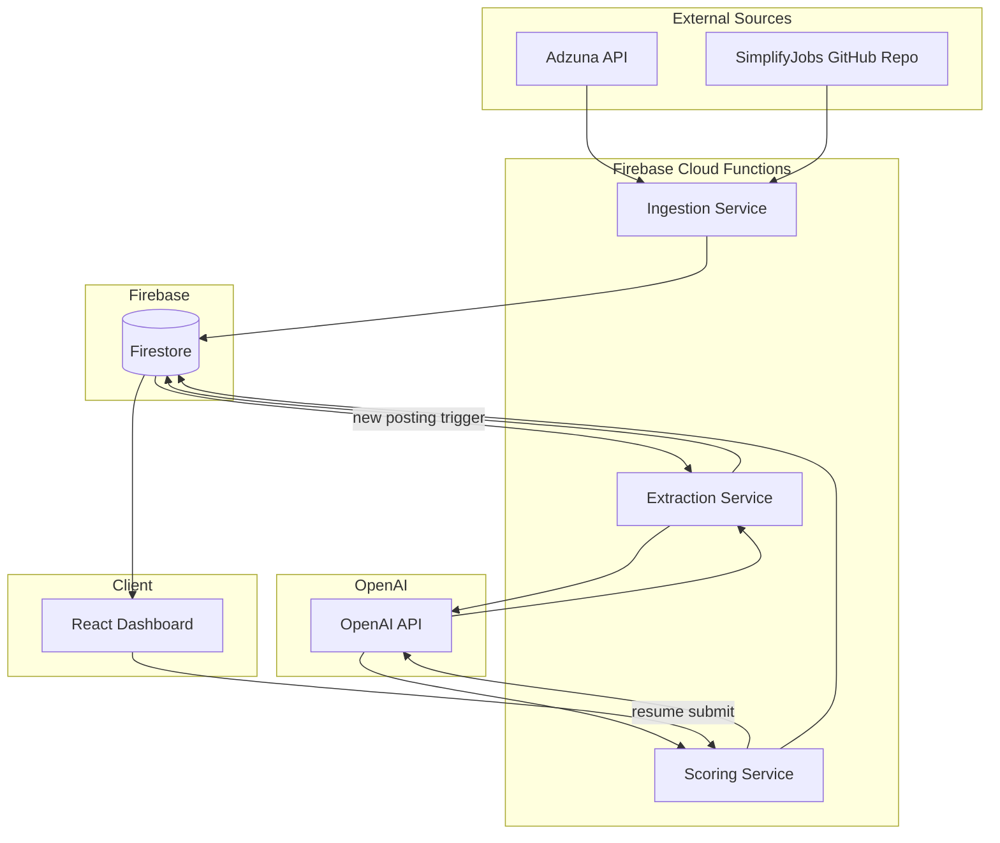

# Design Document

## Overview

InternIQ is a full-stack application that aggregates tech internship postings from two external sources (Adzuna API and SimplifyJobs GitHub repository), enriches them with LLM-extracted structured data, scores them against a user's resume, and presents the results in a React dashboard.

The system follows a pipeline architecture:

1. **Ingestion** — Fetch raw postings from external sources and store in Firestore
2. **Extraction** — Use OpenAI Structured Outputs to extract typed fields from raw posting text
3. **Scoring** — Compare extracted posting data against a user's resume using OpenAI
4. **Presentation** — Display ranked, filterable postings with trend visualizations

### Key Technical Decisions

| Decision | Choice | Rationale |
|----------|--------|-----------|
| Frontend framework | React + TypeScript | Type safety, ecosystem maturity, requirement specifies React |
| Backend runtime | Node.js (Firebase Functions) | Natural fit with Firebase, shared TypeScript types with frontend |
| Database | Firebase Firestore | Requirement-specified; real-time sync for dashboard updates |
| LLM integration | OpenAI API with Structured Outputs (`strict: true`) | Guarantees valid JSON schema conformance for extraction and scoring |
| Charting | Recharts | Lightweight React-native charting library, supports bar charts |
| State management | React Query (TanStack Query) | Handles Firestore query caching, refetching, and loading states |

## Architecture



### Data Flow

1. **Ingestion Service** (triggered manually or on schedule) fetches from Adzuna API and SimplifyJobs, deduplicates, and writes raw postings to Firestore.
2. **Extraction Service** (triggered by Firestore `onCreate`) sends raw posting text to OpenAI with a structured output schema, validates the response, and writes structured fields back to the posting document.
3. **Scoring Service** (triggered by resume submission via HTTP callable) sends resume + posting structured data to OpenAI, receives a match score and gap analysis, and writes results to the posting document.
4. **Dashboard UI** subscribes to Firestore queries with real-time listeners, renders the sorted/filtered posting list, trends chart, and resume input.

## Components and Interfaces

### Ingestion Service

```typescript
// Firebase Cloud Function - scheduled or manually triggered
interface IngestionConfig {
  adzunaAppId: string;
  adzunaApiKey: string;
  simplifyRepoUrl: string;
  maxPostingsPerRun: number; // default: 500
}

interface RawPosting {
  id: string;                // Adzuna ID or derived from company+role
  source: 'adzuna' | 'simplifyjobs';
  rawContent: string;        // Full text of the posting
  ingestedAt: Timestamp;
  status: 'raw' | 'extracted' | 'extraction_failed' | 'needs_manual_review';
}

// Adzuna fetcher
async function fetchAdzunaPostings(config: IngestionConfig): Promise<RawPosting[]>;

// SimplifyJobs parser
async function fetchSimplifyPostings(config: IngestionConfig): Promise<RawPosting[]>;

// Markdown table parser (pure function - testable)
function parseMarkdownTable(markdown: string): ParsedRow[];
function serializeToMarkdownRow(row: ParsedRow): string;

interface ParsedRow {
  company: string;
  role: string;
  location: string;
  applicationLink: string;
  datePosted: string;
}
```

### Extraction Service

```typescript
// Firestore onCreate trigger
interface StructuredFields {
  roleTitle: string;         // max 200 chars
  company: string;           // max 200 chars
  location: string;          // max 200 chars
  techStack: string[];       // max 30 items, each max 50 chars
  deadline: string | null;   // ISO 8601 date or null
  workMode: 'remote' | 'hybrid' | 'onsite';
  summary: string;           // max 200 chars
}

// Validation function (pure - testable)
function validateAndTruncateFields(raw: unknown): StructuredFields;

// Field constraint constants
const FIELD_CONSTRAINTS = {
  roleTitle: { maxLength: 200 },
  company: { maxLength: 200 },
  location: { maxLength: 200 },
  techStack: { maxItems: 30, itemMaxLength: 50 },
  deadline: { format: 'iso8601-date-or-null' },
  workMode: { enum: ['remote', 'hybrid', 'onsite'] },
  summary: { maxLength: 200 },
} as const;
```

### Scoring Service

```typescript
interface ResumeInput {
  text: string;              // max 10,000 chars, min 50 non-whitespace chars
  submittedAt: Timestamp;
}

interface PostingScore {
  matchScore: number;        // integer 1-10
  gapAnalysis: {
    matches: string;         // max 200 chars
    missing: string;         // max 200 chars
  };
  scoredAt: Timestamp;
  resumeHash: string;        // to detect resume changes
}

// Pure validation functions (testable)
function validateResumeInput(text: string): ValidationResult;
function clampScore(score: number): number;  // clamps to 1-10
function validateGapAnalysis(raw: unknown): GapAnalysis;
```

### Dashboard UI Components

```typescript
// Main page layout
function DashboardPage(): JSX.Element;

// Posting list with sorting
function PostingList(props: { postings: Posting[]; resumeSubmitted: boolean }): JSX.Element;

// Individual posting card
function PostingCard(props: { posting: Posting }): JSX.Element;

// Filter panel
interface FilterState {
  location: string;          // max 100 chars
  techStack: string[];       // selected tech tags
  workMode: ('remote' | 'hybrid' | 'onsite')[];
}
function FilterPanel(props: { filters: FilterState; onChange: (f: FilterState) => void }): JSX.Element;

// Tech skills trends chart
function TrendsChart(props: { postings: Posting[] }): JSX.Element;

// Resume input
function ResumeInput(props: { onSubmit: (text: string) => void }): JSX.Element;

// Pure utility functions (testable)
function sortPostings(postings: Posting[], resumeSubmitted: boolean): Posting[];
function filterPostings(postings: Posting[], filters: FilterState): Posting[];
function computeSkillFrequencies(postings: Posting[]): SkillFrequency[];
```

## Data Models

### Firestore Collections

#### `postings` Collection

```typescript
interface PostingDocument {
  // Identity
  id: string;                         // Adzuna ID or `${company}-${role}` hash
  source: 'adzuna' | 'simplifyjobs';

  // Raw data
  rawContent: string;
  ingestedAt: Timestamp;

  // Processing status
  status: 'raw' | 'extracted' | 'extraction_failed' | 'scored' | 'scoring_failed' | 'needs_manual_review';

  // Structured fields (populated after extraction)
  structured?: {
    roleTitle: string;
    company: string;
    location: string;
    techStack: string[];
    deadline: string | null;
    workMode: 'remote' | 'hybrid' | 'onsite';
    summary: string;
  };

  // Scoring (populated after scoring)
  scoring?: {
    matchScore: number;               // integer 1-10
    gapAnalysis: {
      matches: string;
      missing: string;
    };
    scoredAt: Timestamp;
    resumeHash: string;
  };
}
```

#### `sessions` Collection

```typescript
interface SessionDocument {
  id: string;                         // auto-generated
  resumeText: string;                 // max 10,000 chars
  resumeHash: string;                 // SHA-256 of trimmed text
  submittedAt: Timestamp;
}
```

### Firestore Indexes

| Collection | Fields | Order | Purpose |
|-----------|--------|-------|---------|
| postings | scoring.matchScore, ingestedAt | DESC, DESC | Ranked listing |
| postings | status, ingestedAt | ASC, DESC | Extraction queue |
| postings | structured.workMode, scoring.matchScore | ASC, DESC | Filtered queries |

## Correctness Properties

*A property is a characteristic or behavior that should hold true across all valid executions of a system — essentially, a formal statement about what the system should do. Properties serve as the bridge between human-readable specifications and machine-verifiable correctness guarantees.*

### Property 1: Markdown Table Parse Round-Trip

*For any* valid posting record (with non-empty company, role, location, applicationLink, and datePosted fields), serializing it to a markdown table row and then parsing that row back SHALL produce a posting record equivalent to the original.

**Validates: Requirements 2.7**

### Property 2: Parser Resilience with Invalid Rows

*For any* markdown table containing a mix of valid and invalid rows, parsing the table SHALL return results for all valid rows (in order) and skip all invalid rows, such that the count of parsed results equals the count of valid input rows.

**Validates: Requirements 2.5**

### Property 3: Structured Field Validation and Truncation

*For any* raw object with string fields of arbitrary length and a tech stack list of arbitrary size, `validateAndTruncateFields` SHALL produce output where every string field is at most its defined maximum length, the tech stack list has at most 30 items with each item at most 50 characters, and the workMode is one of "remote", "hybrid", or "onsite".

**Validates: Requirements 3.2, 3.3**

### Property 4: Invalid Date Normalization

*For any* string that is not a valid ISO 8601 date (YYYY-MM-DD format), the deadline validation function SHALL return null. *For any* valid ISO 8601 date string, the function SHALL preserve the original value.

**Validates: Requirements 3.5**

### Property 5: Score Clamping Invariant

*For any* numeric value, `clampScore` SHALL return an integer in the range [1, 10] inclusive. Additionally, for any integer already in [1, 10], `clampScore` SHALL return that same value unchanged.

**Validates: Requirements 4.6**

### Property 6: Scoring Response Validation

*For any* scoring response object, the validation function SHALL accept it if and only if the score is an integer in [1, 10] and the gap analysis contains exactly two bullets each at most 200 characters. All other responses SHALL be rejected as invalid.

**Validates: Requirements 4.5, 4.9**

### Property 7: Resume Input Validation

*For any* string, the resume validation function SHALL reject it if the string has more than 10,000 total characters OR fewer than 50 non-whitespace characters, and accept it otherwise.

**Validates: Requirements 4.10, 8.3**

### Property 8: Posting Sort Order Invariant

*For any* list of postings (some scored, some unscored) with `resumeSubmitted = true`, `sortPostings` SHALL return a list where all scored postings appear before all unscored postings, scored postings are ordered by matchScore descending (with ties broken by ingestedAt descending), and unscored postings are ordered by ingestedAt descending.

**Validates: Requirements 5.1, 5.4**

### Property 9: Filter AND Logic Correctness

*For any* list of postings and any combination of filters (location text, tech stack tags, work mode checkboxes), `filterPostings` SHALL return exactly those postings that satisfy ALL active filter criteria simultaneously. Specifically: every posting in the result matches all active filters, and no posting outside the result matches all active filters. When a location filter is active, postings with no location data SHALL be excluded.

**Validates: Requirements 6.2, 6.4, 6.6**

### Property 10: Skill Frequency Top-N Computation

*For any* list of postings with tech stack data, `computeSkillFrequencies` SHALL return at most 10 skills sorted by frequency in descending order, where each reported frequency equals the actual count of postings containing that skill, and no skill outside the result has a higher frequency than any skill inside the result.

**Validates: Requirements 7.1, 7.4**

## Error Handling

### Ingestion Service Errors

| Error Condition | Handling Strategy |
|----------------|-------------------|
| Adzuna API unreachable/error | Retry up to 3 times with exponential backoff (1s base). Log each attempt with timestamp. |
| All Adzuna retries exhausted | Log final failure, mark ingestion run as failed, no partial storage. |
| SimplifyJobs repo unreachable | Retry up to 3 times with exponential backoff (1s base). Log each attempt. |
| Invalid markdown table structure | Log error, retry fetch (may be transient). After 3 failures, mark run as failed. |
| Individual row parse failure | Skip row, log error with row content, continue parsing remaining rows. |

### Extraction Service Errors

| Error Condition | Handling Strategy |
|----------------|-------------------|
| OpenAI API error/timeout | Mark posting as `extraction_failed`, retry up to 3 times (2s base backoff). |
| Response fails JSON parsing | Same as API error — retry with backoff. |
| Missing required structured fields | Same as API error — retry with backoff. |
| Invalid deadline format | Set deadline to null, mark posting as `needs_manual_review`. |
| All 3 extraction retries exhausted | Keep status `extraction_failed`, also mark `needs_manual_review`. |

### Scoring Service Errors

| Error Condition | Handling Strategy |
|----------------|-------------------|
| Resume exceeds 10,000 chars | Reject with validation error immediately (no retry). |
| Resume has < 50 non-whitespace chars | Reject with validation error immediately (no retry). |
| OpenAI API error during scoring | Mark posting as `scoring_failed`, retry up to 3 times (5s base backoff). |
| Non-integer score returned | Mark posting as `scoring_failed`, log malformed response. |
| Gap analysis not exactly 2 bullets | Mark posting as `scoring_failed`, log malformed response. |
| All 3 scoring retries exhausted | Log error permanently, posting remains `scoring_failed`. |

### Dashboard UI Errors

| Error Condition | Handling Strategy |
|----------------|-------------------|
| Scoring timeout (60s) | Dismiss loading indicator, show error message with retry option. |
| Scoring service returns error | Dismiss loading indicator, show error message. |
| Firestore connection lost | Show offline banner, use cached data from React Query. |
| No scored postings available | Display chronological list with message about submitting resume. |

### Retry Strategy

All retries use exponential backoff with the formula: `delay = baseInterval * 2^(attemptNumber - 1)`

| Service | Max Retries | Base Interval | Max Delay |
|---------|-------------|---------------|-----------|
| Ingestion (Adzuna) | 3 | 1 second | 4 seconds |
| Ingestion (SimplifyJobs) | 3 | 1 second | 4 seconds |
| Extraction | 3 | 2 seconds | 8 seconds |
| Scoring | 3 | 5 seconds | 20 seconds |

## Testing Strategy

### Property-Based Tests

Property-based testing is appropriate for this feature because there are multiple pure functions with clear input/output behavior, universal properties that hold across wide input spaces, and the functions under test handle strings, numbers, and collections.

**Library**: [fast-check](https://github.com/dubzzz/fast-check) (TypeScript PBT library)

**Configuration**: Each property test runs a minimum of 100 iterations.

**Tag format**: Each test is tagged with a comment referencing its design property:
```
// Feature: interniq-dashboard, Property {N}: {property_text}
```

| Property | Function Under Test | Generator Strategy |
|----------|--------------------|--------------------|
| 1: Parse round-trip | `parseMarkdownRow` / `serializeToMarkdownRow` | Generate random `ParsedRow` objects with arbitrary strings |
| 2: Parser resilience | `parseMarkdownTable` | Generate markdown tables with mix of valid/malformed rows |
| 3: Field validation | `validateAndTruncateFields` | Generate objects with random-length strings, oversized lists |
| 4: Date normalization | `validateDeadline` | Generate mix of valid ISO dates and arbitrary strings |
| 5: Score clamping | `clampScore` | Generate arbitrary numbers (integers, floats, negatives, large) |
| 6: Scoring validation | `validateScoringResponse` | Generate objects with varying score types and bullet counts |
| 7: Resume validation | `validateResumeInput` | Generate strings with varying whitespace/non-whitespace ratios |
| 8: Posting sort | `sortPostings` | Generate posting lists with random scores and timestamps |
| 9: Filter logic | `filterPostings` | Generate random postings and random filter combinations |
| 10: Skill frequencies | `computeSkillFrequencies` | Generate posting lists with random tech stack arrays |

### Unit Tests (Example-Based)

| Area | Test Cases |
|------|-----------|
| Adzuna pagination | Verify page iteration stops at 500 postings |
| Deduplication | Verify existing posting IDs are skipped |
| Retry exhaustion | Verify final failure after 3 retries |
| Extraction trigger | Verify extraction fires on new posting |
| Sort without resume | Verify chronological order when no scores exist |
| Empty filter results | Verify "no results" message rendered |
| Trends empty state | Verify "no data" message when no tech stacks |
| Loading/timeout states | Verify 60s timeout triggers error UI |

### Integration Tests

| Area | Test Cases |
|------|-----------|
| Adzuna API integration | Mocked API returning paginated results |
| SimplifyJobs fetch | Mocked GitHub raw content response |
| Firestore writes | Verify documents created with correct schema |
| OpenAI structured output | Mocked response conforming to schema |
| End-to-end scoring flow | Resume submit → score → UI update |
| Real-time updates | Firestore listener receives new postings |

### Test Organization

```
tests/
├── unit/
│   ├── ingestion/
│   │   ├── markdownParser.test.ts
│   │   └── adzunaFetcher.test.ts
│   ├── extraction/
│   │   ├── fieldValidation.test.ts
│   │   └── dateValidation.test.ts
│   ├── scoring/
│   │   ├── scoreClamp.test.ts
│   │   ├── resumeValidation.test.ts
│   │   └── responseValidation.test.ts
│   └── dashboard/
│       ├── sortPostings.test.ts
│       ├── filterPostings.test.ts
│       └── skillFrequencies.test.ts
├── property/
│   ├── markdownRoundTrip.prop.test.ts
│   ├── parserResilience.prop.test.ts
│   ├── fieldValidation.prop.test.ts
│   ├── dateNormalization.prop.test.ts
│   ├── scoreClamping.prop.test.ts
│   ├── scoringValidation.prop.test.ts
│   ├── resumeValidation.prop.test.ts
│   ├── postingSort.prop.test.ts
│   ├── filterLogic.prop.test.ts
│   └── skillFrequencies.prop.test.ts
└── integration/
    ├── ingestion.int.test.ts
    ├── extraction.int.test.ts
    ├── scoring.int.test.ts
    └── dashboard.int.test.ts
```

